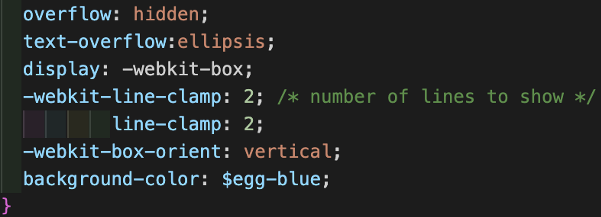
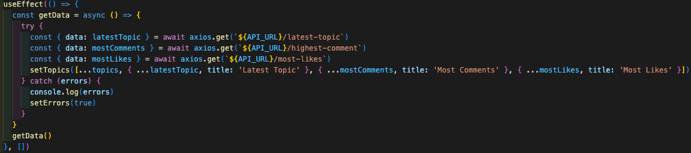

## SEI65 Project 3 Full stack
 
## Read it!

 
 
### Description
 
Project 3 took place during week 9 of the course, at the end of module three. We had just over a week to complete the project. This time round, we would build the API as well as creating a Front-end application that would interact with the API.
 
### Deployment Link
 
You can find the deployed Front-end here:
https://ga-read-it.netlify.app/
 
### Getting Started / Code Installation
 
My GitHub repository for the Front-end:
https://github.com/markmuy40/sei65-project-3-app
 
My GitHub repository for the API:
https://github.com/markmuy40/sei65-project-3-API
 
### Timeframe and Working Team
 
The project was spread over a week and weekend, approximately nine days. This was a three-person group project which was decided by the teaching staff as to who we would be working with.
 
I worked with:
 
Veronica DeRonzi
https://github.com/verodr
 
Rokas Arslaukas
https://github.com/rokster112
 
### Technologies Used
 
#### Front-end
HTML
CSS
SASS
JavaScript
React.JS
React Bootstrap
Netlify – Front-end deployment.
 
 
#### Back-end / API
ExpressJS – Routing for Node.JS.
Mongoose – Object modelling for Node.JS.
Node.JS – JavaScript runtime environment.
MongoDB – Database and Compass for checking data.
Heroku – Back-end deployment.
 
 
#### Development Tools
VSCode – Primary build tool.
Google Dev Tools – inc. Pesticide for Chrome to assist in layout.
Insomnia – Testing the API for requests and Database response.
GitHub – Version control.
 
 
### Brief
 
For Project 3, the idea was to build a full stack application. We had to design a Front-end application that would interact with the Back-end API that we designed. 
 
### Planning
 
Once our groups were decided, we all agreed that a forum application would be a good project as it would showcase all the objectives in the brief and the content would be user driven. I used Excalidraw (virtual whiteboard) to sketch out ideas that we had. 
 
Layout concepts including routes. As I was already sketching and annotating using a green and purple scheme, we figured it would be fun to use similar colourways to Deliveroo. This added to our final Futurama-esque theme, including font.
 
 

Planning the code and pseudocode for the project. Here you can see our initial designs of the userSchema, topicSchema and commentSchema. Also, the bottom left corner has the snag list for the final sprint.

Pseudocode and planning models:
 
 
Ideas we had for deleteComment in pseudocode, add and remove likes to topics. You can also see the errors flagged up in our API during testing.

Axios requests, seeding data and logging errors:

Timeline with order of build and daily write up to see how we were getting on. Bottom right of the image shows the files we would have for the API and App. 

Timeline and file setup:
 
 
 
### Build / Code Process
 
#### Day 1
 
Once signed off, we followed our timeline and created a wireframe in VSCode. We worked together from my machine, giving access using Live share. Whilst we were still new at using GitHub for a group project, this was the safest method to get off the ground.
I set about writing the functions into each file, whilst the other two wrote in the routes and import pages. Once done, we pushed to GitHub and cloned versions so we could start working on separate components.
 
From this point on, I worked on the Seed database file and Seeding data that would appear, allowing us to test the database and check routes. It was essential that I followed the Mongoose schemas we designed for users and topics.
 
I got the Seed database script to work and populated the database with starting data. I made some with and without images, some with comments and one with Lorem Ipsum, so the topic title and content could be handled should someone want to send a wall of text.
 
Lorem ipsum topic in seeding data:

 

With comment added to seeding data:

 
As a group, we all checked the API was working by sending requests in Insomnia:
 
 
#### Day 2
 
We finished checking the API was working, fixing any problems encountered. One of which was that anyone could delete and edit comments, not just the user that made the comments. This was down to using the wrong naming convention. In the userSchema, username was written, but in other files userName was written. Once rectified, we could move onto the Front-end.
 
As before, VSCode and Live share were used to build the Front-end wireframe. 
The files were created as planned, using the draft we had in Excalidraw:

 
 
I wrote an export function for each file and put in a h1 header saying which file had been reached. This way, you could navigate to the page URL and see that it’s all connected. I did the same for the SASS files, creating a styling page with the same matching name, making it easy to style pages independently, reducing merge conflicts. These were all imported to the main.scss file. I also created a variables page and added the hex colours to the file so that they would remain consistent throughout the App. 
 
SCSS files imported into main file:

 
 
Variables file:

 
 
I checked the App was receiving the right response from the Get request to the API so we could map through the data and display the information. Console.log was used to check this.
 
To help get ahead of schedule, I spent the weekend styling the topics, so it looked like a forum. Displaying the username, date and time stamp posted helped with the user experience. The content we wanted to display shouldn’t be all the information, but enough to represent the topic.

The box is big enough to fit a large body of text and using sensible styling I could control the content visible. This is where using Lorem Ipsum was a worthwhile test, checking the information wouldn’t overflow or go outside the boxes.

Checking control of data in containers:

 
 
 
This piece of code used in SCSS ensures that the text doesn’t overflow the sides or bottom. I removed the line clamps so that you could see as much as possible within the container.

 
 
 
This is used to break a word that will span more than the width of the container:
 
 
 
Every morning, we would have a quick stand-up session to reflect on the previous day and discuss what we would work on next. It helped us work together on any sticking points, celebrate our wins, and share improvements.
 
After finishing up the topic page, I moved onto the footer. I set it up a bit like a credits section just to show our LinkedIn pages and GitHub repos. I found out how to open a new tab when the link was clicked, rather than using the existing tab to navigate to the new page. This was missed in my project 2 and I managed to correct it here.
 

It’s quite a simple solution. Just wish I found it for our previous project.
 

 
#### Day 4 and 5
 
I worked on the home page, which displays the latest topic created, the topic with the most comments and the one with most likes. This was an education in MongoDB and how the API can return the information in the Back-end. My tutor sent me some documentation that would help, and he gave me a quick tutorial which I could implement. 
 
MongoDB code to return the relevant information. The first argument in sort() is the key you want to sort by. The second is the order you want it returned, -1 being in descending order, highest / newest first. The limit method reduces the number of topics returned, with the argument being 1, only one object is returned.  I created the custom endpoints whichcould be used in the Front-end.

Using MongoDB to return data in the format we requested:
 

For this to work, the best solution would be to add in new endpoints in the router.js that could handle the Get request to send in the information. This really taught me about endpoints and how they handle information. It's more about the request and the way that it’s handled rather than the name of the endpoint. This helped to simplify the work I was doing.
 
Routes created to handle the requests:

 
I needed a way to track the number of comments. Whilst our topicSchema had a comments object, I didn’t have a way to track and use MongoDB to return the highest number. By adding in a pre-middleware function, the number of comments would be tracked and saved as an object value in the topicSchema.

 

I originally made three separate API requests but was shown a better way making the API requests run in parallel rather than one after the other. This coupled with the spread operator to add in the title of each topic (latest topic, most comments, and most likes), and formatting them into an array made it easy to map through.
 
How it was originally set up:

 
  
And now running in parallel:
 
 
 
This way the code is cleaner and easier to read what is happening. The requests for the data are happening at the same time, rather than waiting for a response before moving on. Also, in this way if the first request fails, the other ones will still run and can return data.
 
Spreading in each topic and adding in the title key, allowed me to map it out in the JSX, so I could display the title value dynamically.
 
Wednesday evening, I went on to do some more styling of the home page. I kept the class names of the various divs and containers the same as the ‘all topics’ page, giving continuity between the home and all topics pages. This works because the naming conventions remain and the SCSS styling can affect both.
 
Remembering the search option from a previous project, I implemented the search function using regExp into this project. It tests against the topic name and returns a filtered array of topics that match the criteria of what’s been typed. Rather than wait, send a request, and then return data, it’s testing against the array that has been returned in all topics. In a real-world scenario where there would be hundreds of topics, this wouldn’t work and a Get request that returned a filtered array from the search criteria would need to be used instead.
 
The regExp code:

 
 
And our search in action:

 

 
 
#### Day 6
 
Styling and deployment of the API. Veronica found a font, Ephesis, which matched the theme we were going for. Rokas did a great job, deploying the API leaving me to deploy the App the following morning. I suggested the homework for us should be to add three to four topics each, adding in extra users and generally making sure everything worked. This really helped bulk out our database and helped me to present with confidence.
 
#### Day 7
 
Friday morning, we were in a good place during our stand up. Only two things left to do before deploying, keeping the footer on the bottom of the page, and making the website responsive. We all worked on the footer and couldn’t sort it. It either got stuck at the bottom of the page when loaded, so when scrolling down it moved up as if it was embedded in that location, or it wouldn’t stay full width when going responsive. When we asked for help, it was pointed out that the various elements were responsive with exception to the topic container not moving as the sizes were fixed. We worked hard but didn’t quite make it before the deadline. We got as far as making the images shrink, but the text containers wouldn’t.
 
In any case, we were happy with the work and effort put in, and the project overall was a success. I deployed it on Netlify and presented our work to the rest of our cohort.
 
### Challenges
 
Although I enjoy the styling aspect, I still have a lot to learn when it comes to building a responsive website that works on multiple platforms. This will come as I build more personal projects including a portfolio.
 
Like project 2, I could’ve asked for help sooner on some of the sticking points. One of them was making various Get requests to show the topics I wanted to display. I struggled initially to map each one out in the JSX as I had three arrays of objects to map through. However, like my previous project I wanted to exhaust every avenue and resource I could to show that I tried to solve the problem before asking for help. It proved fruitful as I learned more about API requests, endpoints, mongoose Schemas and handling the data being returned.
 

### Wins
 
I have a working API and App! The styling is how we conceived it from our planning. Furthermore, it paid dividends as we followed our plan closely, getting the result by being meticulous.
 
I have a much better understanding of GitHub and version control. We had few merge conflicts, but in retrospect, I would appreciate more merge conflicts as that would give me more opportunities to solve them.
 
### Bugs
 
None that the team or I have been able to find.
 
### Key Learnings / Takeaways
 
I reinforced my understanding of the Front-end tech stack, from project 2 until now. Also, I have gained real confidence in Back-end production, understanding MongoDB and how the database can return specific information. My understanding of ExpressJS for routing and creating the right endpoint for your needs, and Mongoose for building the correct model for the information that you will require later, is key to being able to access it in your app. 
 
After leading project 2, I learned to further hone my skills by bringing my experience as a store manager to the table. It allowed us to plan in more detail and work collaboratively. There was consistent communication and forward planning throughout. If I had to lead again, I would implement a Project Management tool. This would help with my personal growth in leadership.
 
I have learned that group programming can be tricky if not handled well, but also, that having difficulty is where the real growth happens. Trying to solve problems amongst your peers and outside resources really helped me to grow my knowledge and understanding, and for our group to bond.
 
### Future Improvements
 
To improve the user experience:
Image hosting – allows users to upload images without the need for hosting themselves.
Button to make hyperlinks in posts – like most forums, where a pop-up form could be filled in to facilitate this, creating an A tag in the text.
Topic edit button – user can edit any information or add links later.
Create a user profile page – where the user can add an avatar, edit their information, change password. As part of that, we could add in a forgotten password page.
Create a better search topic – one that could search the database, rather than filter out from what has been returned.